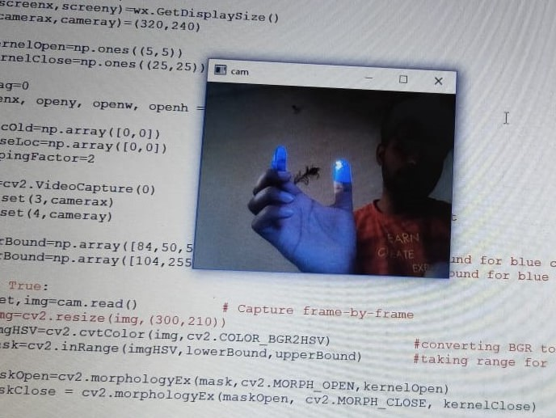
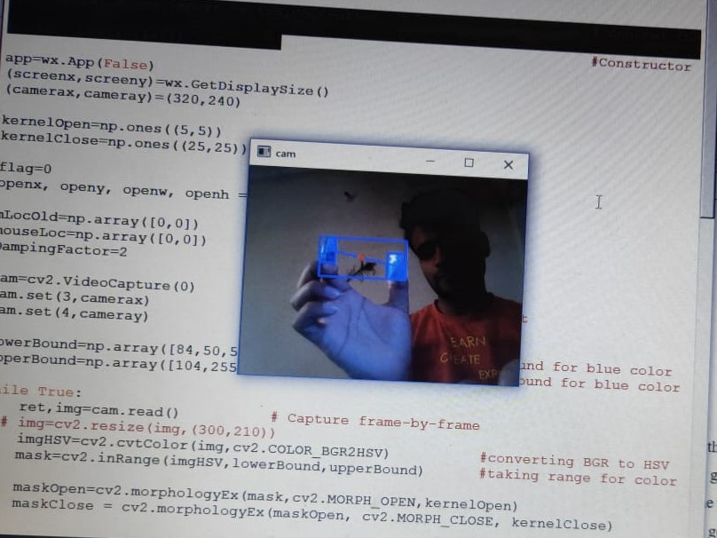

-------------------------------------------------------------------------
# PROJECT ON MOUSE GESTURE
-------------------------------------------------------------------------  
- MooseGesture is a Python module that implements a basic mouse gesture recognition system. It can identify gestures made up of strokes in the eight cardinal and diagonal directions. A mouse gesture is holding down the mouse button and moving the mouse cursor in a specific pattern to issue a command

> COADING IMPLEMENTION

import cv2
import numpy as np
import wx
from pynput.mouse import Button,Controller                        

mouse = Controller()                                              

app=wx.App(False)
(screenx,screeny)=wx.GetDisplaySize()
(camerax,cameray)=(320,240)

kernelOpen=np.ones((5,5))
kernelClose=np.ones((25,25))

flag=0
openx, openy, openw, openh = (0, 0, 0, 0)

mLocOld=np.array([0,0])
mouseLoc=np.array([0,0])
DampingFactor=2

cam=cv2.VideoCapture(0)        
cam.set(3,camerax)             
cam.set(4,cameray)

lowerBound=np.array([84,50,50])     
upperBound=np.array([104,255,255])     

while True:
    ret,img=cam.read()         

    imgHSV=cv2.cvtColor(img,cv2.COLOR_BGR2HSV)      
    mask=cv2.inRange(imgHSV,lowerBound,upperBound)     

    maskOpen=cv2.morphologyEx(mask,cv2.MORPH_OPEN,kernelOpen)                     
    maskClose = cv2.morphologyEx(maskOpen, cv2.MORPH_CLOSE, kernelClose)        

    maskFinal=maskClose
    conts,h=cv2.findContours(maskFinal.copy(),cv2.RETR_EXTERNAL,cv2.CHAIN_APPROX_NONE)    

    if(len(conts)==2):
        if(flag==1):
            flag=0
            mouse.release(Button.left)
        x1,y1,w1,h1=cv2.boundingRect(conts[0])
        x2,y2,w2,h2=cv2.boundingRect(conts[1])
        cv2.rectangle(img,(x1,y1),(x1+w1,y1+h1),(255,0,0),2)                    
        cv2.rectangle(img, (x2, y2), (x2 + w2, y2 + h2), (255, 0, 0), 2)            
        cx1=int(x1+w1/2)
        cy1=int(y1+h1/2)
        cx2=int(x2+w2/2)
        cy2=int(y2+h2/2)
        cx = int((cx1+cx2)/2)
        cy = int((cy1+cy2)/2)
        cv2.line(img,(cx1,cy1),(cx2,cy2),(255,0,0),2)           
        cv2.circle(img,(cx,cy),2,(0,0,255),3)                        

        mouseLoc=mLocOld+((cx,cy)-mLocOld)/DampingFactor

        mouse.position = ((int(screenx - (mouseLoc[0] * screenx) / camerax)), int((mouseLoc[1] * screeny) / cameray))
        while (mouse.position != ((int(screenx - (mouseLoc[0] * screenx) / camerax)), int((mouseLoc[1] * screeny) / cameray))):
            pass
        mLocOld=mouseLoc

        openx,openy,openw,openh=cv2.boundingRect(np.array([[[x1,y1],[x1+w1,y1+h1],[x2,y2],[x2+w2,y2+h2]]]))
        cv2.rectangle(img, (openx, openy), (openx + openw, openy + openh), (255, 0, 0), 2)

    elif(len(conts)==1):
        x, y, w, h = cv2.boundingRect(conts[0])

        if (flag == 0):
            #error
            if(abs(((w*h)-(openw*openh))*100)/(w*h)<25):
                flag = 1
                mouse.press(Button.left)
                openx,openy,openw,openh=(0,0,0,0)
        else:

             cv2.rectangle(img, (x, y), (x + w, y + h), (255, 0, 0), 2)
             cx=int(x+w/2)
             cy=int(y+h/2)
             cv2.circle(img,(cx,cy),int((w+h)/4),(0,0,255),2)
             mouseLoc = mLocOld + ((cx, cy) - mLocOld) / DampingFactor
             mouse.position = ((int(screenx - (mouseLoc[0] * screenx) / camerax)), int((mouseLoc[1] * screeny) / cameray))
             while (mouse.position != ((int(screenx - (mouseLoc[0] * screenx) / camerax)), int((mouseLoc[1] * screeny) / cameray))):
                 pass
             mLocOld = mouseLoc

    cv2.imshow("cam",img)
    cv2.waitKey(5)
